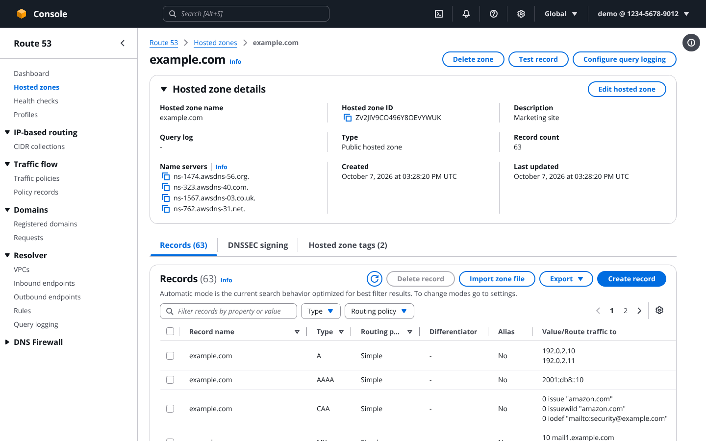
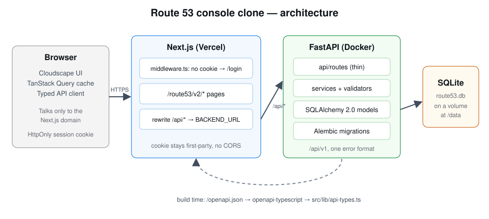
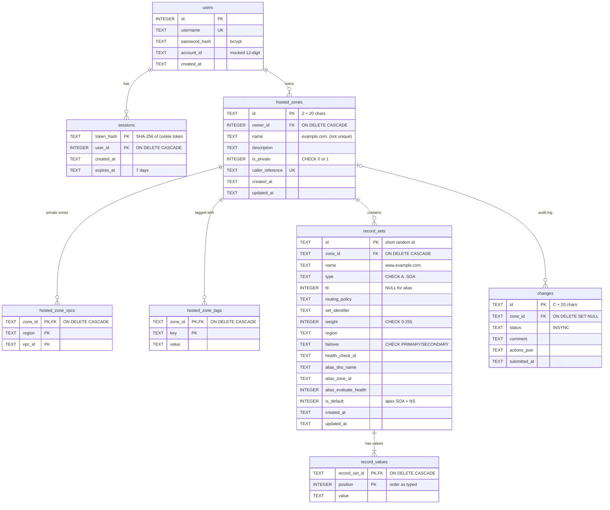

# AWS Route 53 Console Clone

A look-alike of the AWS Route 53 console: a mocked sign-in, then full create, read, update and delete for hosted zones and DNS records, stored in SQLite. A FastAPI backend serves a Next.js (TypeScript) frontend built with **Cloudscape**, the open-source design system AWS uses for its own console.

| | |
| --- | --- |
| **Live demo** | _Add your hosted link here after deploying (see [Deployment](#deployment))_ |
| **Demo sign-in** | IAM user · Account ID `123456789012` · user `demo` · password `demo1234` (or click **Use demo account**) |
| **Second account** | `alice` / `alice1234`, account `210987654321`, to show zones are isolated per user |
| **API docs** | `<backend-url>/docs` (FastAPI's interactive Swagger UI) |



---

## Features

**Core (all working)**

- [x] Mocked AWS sign-in (root user or IAM user), logout, and sessions that survive a refresh, a new tab or a backend restart
- [x] Hosted zones: list, search, filter by type, sort, paginate, create (public or private with VPCs, plus tags), view details, edit, delete
- [x] DNS records: list, search by name or value, filter by type and routing policy, paginate, create, edit, delete. Types: **A, AAAA, CNAME, TXT, MX, NS, PTR, SRV, CAA** (plus editing the default SOA)
- [x] Route 53 behaviour: automatic NS and SOA records, four `awsdns` name servers, CNAME rules, identity rule, Route 53 error codes and wording ([details](#route-53-behaviours-implemented))
- [x] Console look and feel: top bar, Route 53 side navigation, breadcrumbs, Flashbar banners, help panel opened by **Info** links, split panel for record details, typed delete confirmation, table preferences
- [x] Routing policies: Simple, Weighted, Latency, Failover and Multivalue answer. Geolocation, Geoproximity and IP-based are listed but disabled
- [x] Alias records (CloudFront, S3, load balancers, API Gateway, another record in the zone, and more; targets are simulated)
- [x] **Coming soon** pages inside the console shell for Dashboard tiles, Health checks, Traffic policies, Resolver, Profiles and every other navigation item
- [x] Seed data: 5 zones for `demo` (one private, one with 63 records across all nine types so pagination shows) and 1 zone for `alice`

**Bonus (all five)**

- [x] Dark mode: **Settings → Visual mode** (Browser default / Light / Dark), remembered in `localStorage`
- [x] Export a zone as BIND or JSON (Route 53's `ResourceRecordSets` shape): **Records → Export**
- [x] Bulk operations: select several records, then **Delete record** deletes them in one all-or-nothing change batch. **Add another record** creates several records in one batch
- [x] BIND zone-file import: paste or upload a file, preview with per-line errors, then import as one change batch
- [x] Keyboard shortcuts: `/` focuses search, `c` creates, `r` refreshes, `Esc` closes dialogs, `?` lists the shortcuts, `Alt+S` focuses the console search

## Tech stack

| Layer | Choice |
| --- | --- |
| Frontend | Next.js 15 (App Router) · TypeScript (strict, no `any`) · Cloudscape Design System · TanStack Query |
| API types | Generated from FastAPI's OpenAPI schema with `openapi-typescript` |
| Backend | FastAPI · Pydantic v2 · SQLAlchemy 2.0 (typed `Mapped[]` models) · Alembic · dnspython · bcrypt |
| Database | SQLite, with foreign keys switched on for every connection |
| Quality | Ruff (lint and format) · pytest (41 tests) · ESLint · Prettier · `tsc --noEmit` · Playwright smoke test · GitHub Actions CI |

## Architecture overview



1. The browser only ever talks to the **Next.js** domain. `middleware.ts` sends anyone without a session cookie to `/login?next=…`.
2. Next.js rewrites every `/api/*` request to the **FastAPI** backend (`BACKEND_URL`). The session cookie therefore stays first-party, and no CORS is needed.
3. FastAPI routes are thin. They parse input with Pydantic, resolve the signed-in user with `get_current_user`, call a **service**, and return a schema.
4. Services hold every Route 53 rule. They normalise names, run the per-type **validator** and the cross-record checks, then write the record set, its values and a **change** row in one transaction.
5. Only FastAPI touches the **SQLite** file. On the frontend, TanStack Query invalidates the affected queries after each write, so table counters and record counts refresh, and a Flashbar banner confirms the change.

**Repository layout**

```
├── backend/                 FastAPI app
│   ├── app/
│   │   ├── main.py          app factory, routers, error handlers
│   │   ├── core/            settings, password + session-token helpers, AppError
│   │   ├── db/              engine (PRAGMA foreign_keys=ON), get_db
│   │   ├── models/          8 SQLAlchemy models
│   │   ├── schemas/         Pydantic request/response models, Page[T], error model
│   │   ├── api/             deps (current user, pagination) + routes/
│   │   ├── services/        zone_service, record_service, change_batch, import/export, auth
│   │   ├── validators/      one module per record type (a.py, aaaa.py, … caa.py, soa.py)
│   │   ├── utils/           ids, name normalisation, name-server picker, BIND parse/serialise
│   │   └── seed.py          demo users and zones
│   ├── alembic/versions/    migrations
│   └── tests/               pytest + TestClient
├── frontend/                Next.js app
│   ├── src/middleware.ts    session guard
│   ├── src/app/             login + route53/v2/... pages (URLs mirror the real console)
│   ├── src/components/      layout/, hosted-zones/, records/, common/
│   ├── src/lib/             api/ (typed client + hooks per resource), api-types.ts (generated),
│   │                        notifications.tsx (Flashbar), validation/, console.tsx (shell context)
│   └── e2e/                 Playwright smoke test
├── docs/                    architecture diagram and screenshots
└── docker-compose.yml       both services in one command
```

## Database schema



**Indexes:** `ux_rrset_identity` is UNIQUE on `(zone_id, name, type, IFNULL(set_identifier, ''))`. Non-unique indexes: `ix_zones_owner_name (owner_id, name)`, `ix_rrset_zone_type (zone_id, type)` and `ix_sessions_user_id`.

**Design decisions**

- **No unique constraint on zone name.** Real Route 53 lets you create several hosted zones with the same name; the ID identifies a zone, not the name.
- **Record values are a child table, not a JSON blob.** A record with three IPs is three rows, values are searchable in SQL, and the order the user typed is kept in `position`.
- **The identity unique index mirrors Route 53's rule:** one record set per name, type and set identifier in a zone. `IFNULL` makes two simple records with no set identifier collide, as they should.
- **The record count is computed with a `COUNT` subquery**, never stored, so it cannot go stale.
- **Names are stored normalised** (lower case, trailing dot) and displayed the way the console shows them (no trailing dot).
- **The routing-policy columns exist from day one.** Adding a policy is a UI change, not a migration.
- **`PRAGMA foreign_keys=ON` runs on every connection.** Without it, SQLite silently ignores every `ON DELETE CASCADE`.
- **Only the SHA-256 of the session token is stored,** so a leaked database cannot be replayed as cookies.

## API overview

All routes are under `/api/v1` and need the session cookie, except login and health. The interactive docs are at **`/docs`** on the backend.

| Method | Path | Purpose | Success |
| --- | --- | --- | --- |
| POST | `/api/v1/auth/login` | Check credentials, set the HTTP-only session cookie | 200 user |
| POST | `/api/v1/auth/logout` | Delete the session row, clear the cookie | 204 |
| GET | `/api/v1/auth/me` | Who is signed in | 200 user, or 401 |
| GET | `/api/v1/hostedzones` | List zones. Query: `search`, `type`, `page`, `page_size`, `sort`, `order` | 200 page |
| POST | `/api/v1/hostedzones` | Create a zone, including its default SOA and NS records | 201 zone + change |
| GET | `/api/v1/hostedzones/{zone_id}` | Zone details: name servers, record count, tags, VPCs | 200 |
| PATCH | `/api/v1/hostedzones/{zone_id}` | Edit description, tags and VPC associations | 200 zone + change |
| DELETE | `/api/v1/hostedzones/{zone_id}` | Delete; refused while non-default records exist | 204, or 409 |
| GET | `/api/v1/hostedzones/{zone_id}/records` | List records. Query: `search`, `type`, `routing_policy`, `page`, `page_size`, `sort`, `order` | 200 page |
| POST | `/api/v1/hostedzones/{zone_id}/records` | Create one record set | 201 record + change |
| GET | `/api/v1/hostedzones/{zone_id}/records/{record_id}` | One record set | 200 |
| PUT | `/api/v1/hostedzones/{zone_id}/records/{record_id}` | Replace values, TTL and routing fields (name and type are fixed) | 200 record + change |
| DELETE | `/api/v1/hostedzones/{zone_id}/records/{record_id}` | Delete; the default SOA and apex NS are refused | 204, or 400 |
| POST | `/api/v1/hostedzones/{zone_id}/changes` | Atomic batch of CREATE / UPSERT / DELETE actions | 200 change |
| GET | `/api/v1/changes/{change_id}` | Change status (always `INSYNC`) | 200 |
| POST | `/api/v1/hostedzones/{zone_id}/import?dry_run=true` | Parse a BIND zone file; `dry_run=false` commits it | 200 |
| GET | `/api/v1/hostedzones/{zone_id}/export?format=bind\|json` | Download the zone | 200 file |
| GET | `/api/health` | Liveness check | 200 |

**Request shapes**

```jsonc
// POST /api/v1/hostedzones
{ "name": "example.com", "description": "Marketing site", "type": "public",
  "vpcs": [], "tags": [{ "key": "env", "value": "prod" }] }

// POST /api/v1/hostedzones/{zone_id}/records   ("www", "www.example.com" and "www.example.com." are equivalent)
{ "name": "www", "type": "A", "ttl": 300, "values": ["192.0.2.10", "192.0.2.11"],
  "routing_policy": "SIMPLE", "alias": null }

// Every list endpoint
{ "items": [ ... ], "total": 42, "page": 1, "page_size": 10 }
```

**One error format, everywhere.** FastAPI's own 422 validation errors are converted to it too.

```json
{ "error": { "code": "InvalidInput", "message": "The record value is not a valid IPv4 address: 192.0.2.999",
             "field_errors": [{ "field": "values[1]", "message": "The record value is not a valid IPv4 address: 192.0.2.999" }] } }
```

| Code | Status | When |
| --- | --- | --- |
| `InvalidInput` | 400 | A field fails validation (each bad field is listed in `field_errors`) |
| `InvalidChangeBatch` | 400 / 409 | A Route 53 rule is broken (CNAME conflicts, deleting the SOA). A duplicate record returns 409 with Route 53's "already exists" wording |
| `NoSuchHostedZone` | 404 | The zone doesn't exist **or belongs to another user** (never 403, so IDs can't be probed) |
| `HostedZoneNotEmpty` | 409 | Deleting a zone that still has non-default records |
| `NotAuthenticated` / `InvalidCredentials` | 401 | No valid session / wrong sign-in details |

## Setup instructions

**Prerequisites:** Python 3.12 or newer (3.13 and 3.14 tested), Node.js 20 or newer (22 tested) and Git. On macOS, use `python3` for the first command below; once the virtual environment is active, `python` works.

### Backend (terminal 1)

```bash
cd backend
python3 -m venv .venv
source .venv/bin/activate              # Windows: .venv\Scripts\activate
python -m pip install -r requirements.txt
cp .env.example .env                   # optional; the defaults work locally (Windows: copy)
python -m alembic upgrade head         # creates route53.db (prints nothing on success)
python -m app.seed                     # demo users and zones (skipped if the DB has data)
python -m uvicorn app.main:app --reload
```

Check http://localhost:8000/api/health returns `{"status":"ok"}`. API docs are at http://localhost:8000/docs.

> Run the tools as `python -m …` with the environment active. That guarantees they use the project's own Python. A plain `uvicorn` or `pip` can resolve to another Python install on your machine and fail with `ModuleNotFoundError`.

### Frontend (terminal 2)

```bash
cd frontend
npm install
cp .env.local.example .env.local       # BACKEND_URL=http://localhost:8000 (Windows: copy)
npm run dev
```

Open **http://localhost:3000** and choose **Use demo account**. The first page load takes a few seconds while Next.js compiles it.

> The session cookie is `Secure`. Browsers accept Secure cookies on `http://localhost`, so use `localhost`, not `127.0.0.1`. To serve the app over plain HTTP on any other host, set `SESSION_COOKIE_SECURE=false` in `backend/.env`.

### Troubleshooting

| Symptom | Fix |
| --- | --- |
| `ModuleNotFoundError` when starting the backend | Activate the environment (`source .venv/bin/activate`) and start it with `python -m uvicorn …` |
| `ERR_EMPTY_RESPONSE` on port 8000 | An old server is stuck. Run `lsof -ti:8000 \| xargs kill -9` (macOS/Linux) and start again |
| Sign-in succeeds but you land back on the login page | Open the app at `http://localhost:3000`, not `127.0.0.1` |
| You want fresh demo data | Stop the backend, delete `backend/route53.db`, then rerun `python -m alembic upgrade head` and `python -m app.seed` |

### Everything with Docker

```bash
docker compose up --build          # http://localhost:3000
```

The SQLite file lives in the `route53-data` volume and is seeded on first start.

### Useful scripts

| Where | Command | What it does |
| --- | --- | --- |
| backend | `python -m ruff check . && python -m ruff format --check .` | Lint and format check |
| backend | `python -m pytest` | Run the test suite |
| frontend | `npm run typecheck` | `tsc --noEmit` |
| frontend | `npm run lint` / `npm run format:check` | ESLint / Prettier |
| frontend | `npm run gen:api` | Regenerate `src/lib/api-types.ts` from a running backend's `/openapi.json` |
| frontend | `npm run e2e` | Playwright smoke test against a running app |

## Tests

```bash
cd backend && python -m pytest     # 41 tests, about 20 seconds
cd frontend && npm run e2e         # needs the frontend and backend running
```

- **Auth:** login, `/me` and logout cycle; cookie flags (`HttpOnly`, `SameSite=Lax`, 7-day `Max-Age`); wrong password and wrong account rejected; protected routes return 401.
- **Hosted zones:** default NS (4 servers on .com/.net/.org/.co.uk, TTL 172800) and SOA (TTL 900) created; name rules (bare TLD, bad characters, 64-character labels); private zone needs a VPC; duplicate names allowed; search, type filter and pagination; edit; delete refused while records exist; another user's zone returns 404.
- **Records:** every one of the nine types accepts its format and rejects a bad value with a `values[i]` field error; TXT auto-quoting; name normalisation (`www`, `www.example.com` and `www.example.com.` collide); records outside the zone rejected; CNAME at the apex and CNAME conflicts refused; default records editable but not deletable; weighted records need a set identifier and weight, and can't mix with simple routing; SQL search and pagination.
- **Change batches:** all-or-nothing rollback with `changes[2].record_set.values[0]` error paths; UPSERT; bulk delete; validation errors in the shared format.
- **Import / export:** dry-run preview with per-line errors and the apex SOA/NS skipped, then commit; BIND and JSON export.
- **End to end (Playwright):** sign in, reload, create a zone, a rejected and then a valid record, CNAME at the apex refused, zone deletion blocked, bulk delete, zone delete, sign out, protected URL redirects. It also fails on any browser console error.

## Route 53 behaviours implemented

- Creating a zone also creates the **apex NS** record (4 name servers in Route 53's `ns-N.awsdns-NN.{com,net,org,co.uk}` shape, random per zone, TTL 172800) and the **SOA** record (`ns-… hostmaster.<zone> 1 7200 900 1209600 86400`, TTL 900). A new zone shows a record count of **2**.
- The default SOA and NS can be **edited but never deleted**. Route 53's messages: "A HostedZone must contain exactly one SOA record." and "…at least one NS record for the zone itself."
- **Zone IDs** look like `Z0123456789ABCDEFGHIJ` and have a copy button; every write returns a **change ID** (`C…`) with status `INSYNC`.
- **Domain names:** letters, digits and hyphens per label, labels up to 63 characters, names up to 255; a bare TLD is rejected. **Description** up to 256 characters.
- **Private zones** need at least one VPC (region and VPC ID, simulated). Only the description, tags and VPCs can change after creation.
- A zone with records other than the default SOA and NS can't be deleted (`HostedZoneNotEmpty`), and the console shows a warning instead of the confirmation field.
- **Record values** are validated per type (table below). One value per line; TXT strings are quoted automatically, and each must be 255 characters or fewer (4,000 total).
- **CNAME** can't be at the apex, can't share its name with any other record, and has exactly one value.
- **Identity rule:** a name + type + set identifier can exist only once per zone (409, "Tried to create resource record set … but it already exists").
- Record names may be the zone name or any subdomain; a leading `*` wildcard label is allowed.
- **TTL** is 0 to 2147483647 seconds (default 300, with 1m / 1h / 1d shortcuts). **Alias** records have no TTL.
- **Routing:** simple allows one record set per name and type. Weighted, latency, failover and multivalue need a record ID (set identifier); weighted needs a weight from 0 to 255, failover needs PRIMARY or SECONDARY, and latency needs a Region. Record sets with one name and type can't mix policies.
- **Change batches** apply fully or not at all, like `ChangeResourceRecordSets`.

| Type | Format | Example |
| --- | --- | --- |
| A | IPv4 address | `192.0.2.1` |
| AAAA | IPv6 address | `2001:db8::8a2e:370:7334` |
| CNAME | one domain name | `hostname.example.com` |
| TXT | quoted strings | `"v=spf1 include:_spf.example.com ~all"` |
| MX | priority domain | `10 mail.example.com` |
| NS | domain name | `ns-1.example.com` |
| PTR | domain name | `hostname.example.com` |
| SRV | priority weight port target | `10 5 80 hostname.example.com` |
| CAA | flags tag "value" | `0 issue "ca.example.net"` |

## Deployment

The frontend runs on **Vercel**. The backend runs in **Docker** on a host with a persistent volume for the SQLite file; **Railway** is recommended, and `backend/railway.json` is included.

1. **Backend (Railway).** Create a service from this repo with root directory `backend/`. Railway builds the `Dockerfile`, which runs `alembic upgrade head`, seeds an empty database, then starts uvicorn on `$PORT`. Add a **volume mounted at `/data`**; `DATABASE_URL` already defaults to `sqlite:////data/route53.db`. Check that `https://<backend>/api/health` returns `{"status":"ok"}`.
2. **Frontend (Vercel).** Import the repo with root directory `frontend/` and set the environment variable `BACKEND_URL=https://<backend>`. Rewrites are compiled at build time, so redeploy after changing it.
3. Open the Vercel URL in a private window and run through the flow: sign in, create a zone, add records, search, paginate, edit, delete, sign out.

Fly.io or any VPS also works (same Dockerfile, with a volume at `/data`). Avoid hosts with an ephemeral disk, such as Render's free tier: the database would be wiped on every restart.

## Trade-offs and future work

- **Mocked:** IAM, accounts, sign-up, MFA, billing and organizations; VPCs, health checks and alias targets are placeholder IDs; nothing resolves real DNS. **Test record** answers from the stored records.
- **Routing policies:** Simple, Weighted, Latency, Failover and Multivalue are complete. Geolocation, Geoproximity and IP-based are shown but disabled.
- **Not built:** DNSSEC signing, query logging, the record-creation wizard, and the other console sections (health checks, traffic flow, Resolver, domains), which show Coming soon pages.
- **Next steps:** Postgres for multi-instance deployments; rate limiting on sign-in; geolocation routing; change history in the UI (the `changes` table already records every action); more end-to-end coverage.
